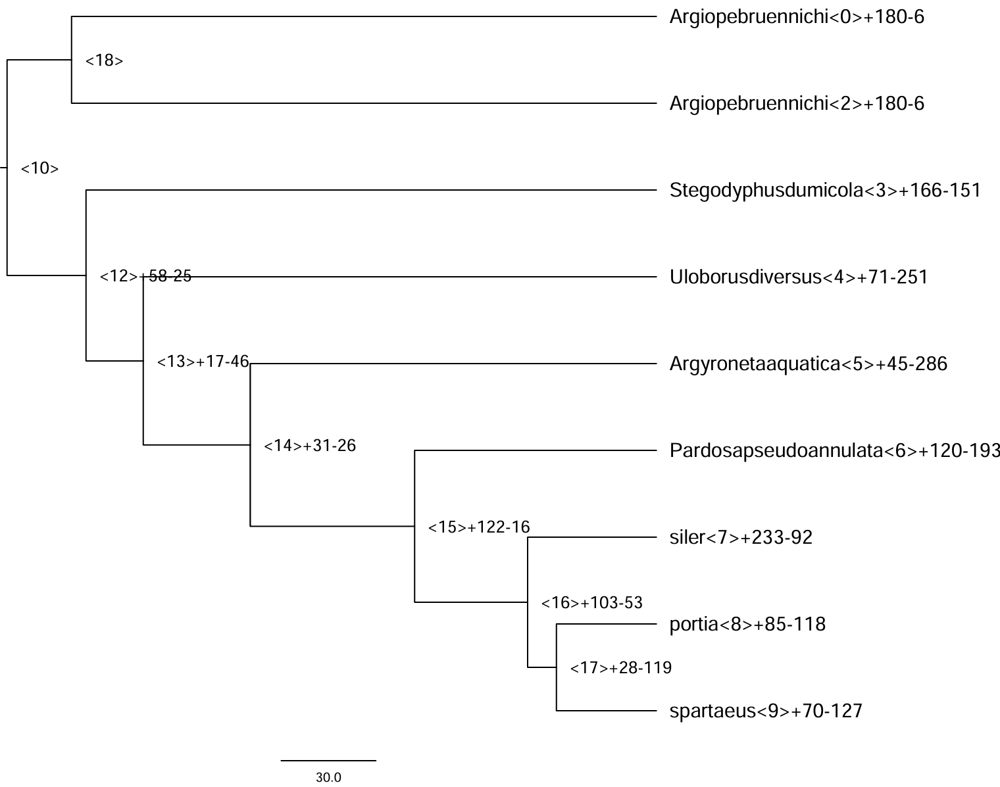
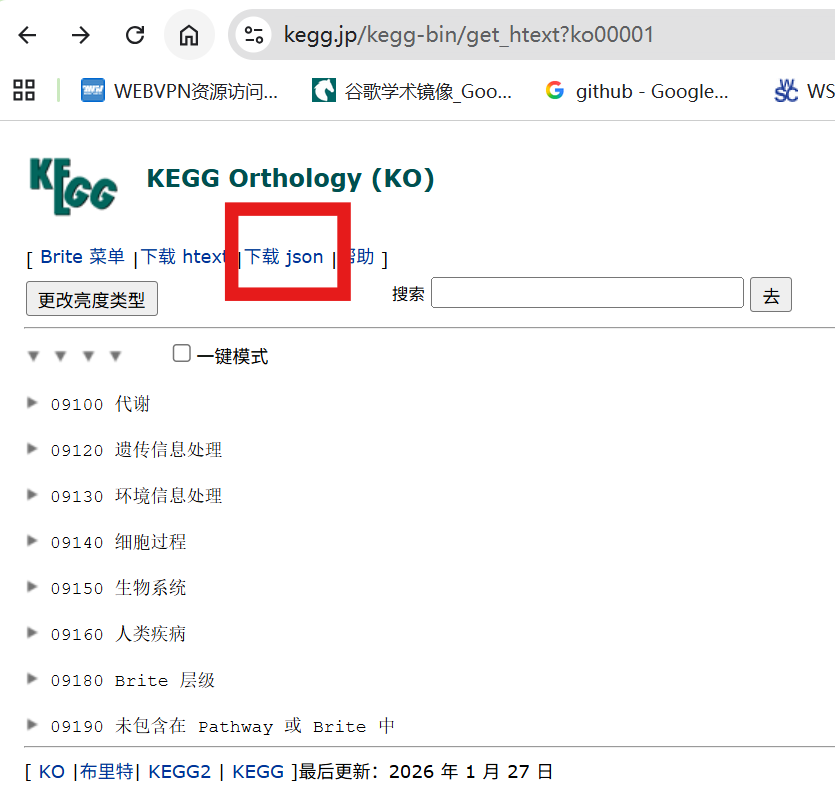

在[比较基因组学分析2：CAFE5 基因家族分析](https://zyyang0124.github.io/p/cafe-genefamily1/)中，我们探讨了基于 cafe5 的基因家族扩张和收缩的分析。

本博文以 node 7 为例，进行节点特异的功能富集分析。

## 1. 获取目的基因

这一部分的关键在于目标基因与背景基因的合理选择。目标基因通常指在该节点显著扩张的基因家族中所包含的全部物种基因。背景基因一般选取该节点对应的所有 Orthogroup，用于构建适合该节点的参考基因集合。

### 1.1 获取 node7 显著扩张的基因
    
    # node7 显著扩张的orthogroupsID
    cat Gamma_change_sig0.05.tsv | cut -f1,8 | awk '$2 > 0' | cut -f1 > node7.expand

    # 提取 node7 显著扩张的基因
    grep -f node7.expand Orthogroups.tsv | cut -f9 | \
    sed "s/ /\\n/g" | sed "s/\t/\\n/g" | sed "s/,//g" | \
    sort | uniq > node7.expand.genes

### 1.2 node7 背景基因的选择

    # node7中存在基因的orthogroupsID
    awk 'NR!=1 && $8>0 {print $0}' Gamma_count.tab | cut -f1 > node7.orthogroups

    grep -f node7.orthogroups Orthogroups.tsv | cut -f9 | \
    sed "s/ /\n/g" | sed "s/\t/\n/g" | sed "s/,//g" | sort | uniq > node7.genes

`node7.genes` 和 `node7.expand.genes` 就是进行富集分析所需的基因ID，接下来就是构建背景基因的GO和KEGG注释。由于是无参物种，所以需要自己构建。

## 2. 构建背景基因的 GO 和 KEGG 注释
### 2.1 GO 和 KEGG 注释

使用 eggong 对背景基因进行注释

    #提取背景基因，需要严格注意基因数是否一致
    seqkit grep -f node7.genes \
        /home/salticidae/disk_computation/zy_gene_family_evo_analysis/1_orthofinder/proteins/siler.faa \
        > node7.fa

    /home/salticidae/install/eggnog-mapper-2.1.12/emapper.py \
    -m diamond -i node7.fa -o node7 --cpu 16

现在，我们得到`node7.emapper.annotations`文件，将前三行内容和 “#” 删除。

### 2.2 GO 注释库构建

首先需要获取 GO 的基础注释文件，可从以下地址下载： http://purl.obolibrary.org/obo/go/go-basic.obo 下载完成后，应根据分析需求对该文件进行整理与格式修饰，以构建适用于本物种的 GO 注释库。

    wget https://current.geneontology.org/ontology/go-basic.obo
    # 1. 提取GO ID
    grep "^id:" go-basic.obo | awk '{print $2}' > GO.id
    # 2. 提取GO名称
    grep "^name:" go-basic.obo | sed 's/^name: //' > GO.name
    # 3. 提取GO分类
    grep "^namespace:" go-basic.obo | awk '{print $2}' > GO.class
    # 4. 合并三个文件
    paste GO.id GO.name GO.class -d "\t" > GO.library

### 2.3 KEGG 注释库构建

构建 KEGG 注释库需要获取 KEGG 的层级信息文件。可从以下链接下载 ko00001.json。下载地址https://www.genome.jp/kegg-bin/get_htext?ko00001。

下载后将其整理为可解析的本地 KEGG 注释文件，以便后续提取 KO 层级关系并用于富集分析。

    # nano kegg_parser.R

    # kegg_parser.R
    library(jsonlite)
    library(purrr)
    library(RCurl)
    library(dplyr)
    library(stringr)

    kegg <- function(json = "ko00001.json") {
        # 初始化存储对象
        pathway2name <- tibble(Pathway = character(), Name = character())
        ko2pathway <- tibble(Ko = character(), Pathway = character())
        
        # 读取 JSON 数据
        kegg_data <- fromJSON(json)
        
        # 遍历 KEGG 层级结构
        for (a in seq_along(kegg_data[["children"]][["children"]])) {
            A <- kegg_data[["children"]][["name"]][[a]]
            
            for (b in seq_along(kegg_data[["children"]][["children"]][[a]][["children"]])) {
                B <- kegg_data[["children"]][["children"]][[a]][["name"]][[b]]
                
                for (c in seq_along(kegg_data[["children"]][["children"]][[a]][["children"]][[b]][["children"]])) {
                    # 提取通路信息
                    pathway_info <- kegg_data[["children"]][["children"]][[a]][["children"]][[b]][["name"]][[c]]
                    
                    # 提取通路 ID 和名称
                    pathway_id <- str_match(pathway_info, "ko[0-9]{5}")[1]
                    pathway_name <- str_replace(pathway_info, " \\[PATH:ko[0-9]{5}\\]", "") %>%
                                str_replace("[0-9]{5} ", "")
                    
                    # 添加到通路-名称对照表
                    pathway2name <- rbind(pathway2name, 
                                        tibble(Pathway = pathway_id, Name = pathway_name))
                    
                    # 提取 KO 信息
                    kos_info <- kegg_data[["children"]][["children"]][[a]][["children"]][[b]][["children"]][[c]][["name"]]
                    kos <- str_match(kos_info, "K[0-9]*")[,1]
                    
                    # 添加到 KO-通路对照表
                    ko2pathway <- rbind(ko2pathway, 
                                    tibble(Ko = kos, Pathway = rep(pathway_id, length(kos))))
                }
            }
        }
        
        # 重命名列
        colnames(ko2pathway) <- c("KO", "Pathway")
        
        # 保存结果
        save(pathway2name, ko2pathway, file = "kegg_info.RData")
        write.table(pathway2name, "KEGG.library", sep = "\t", row.names = F)
    }

    # 调用函数
    kegg(json = "ko00001.json")

    # Rscript kegg_parser.R

### 2.4 构建背景注释

背景注释的构建核心在于将自身基因集与前面整理好的 GO 或 KEGG 注释库进行匹配。 通过将 Orthogroup 中的所有基因与注释信息对接，可以生成适用于富集分析的背景基因注释表，为后续统计检验提供可靠的参考基准。

    # nano GO_KEGG_annotation.R
    # 加载必要的库
    library(clusterProfiler)
    library(dplyr)
    library(stringr)
    options(stringsAsFactors = F)

    ## STEP1: GO注释生成
    # 首先需要读入文件
    egg <- read.delim("node7.emapper.annotations", header = T, sep = "\t")
    egg[egg == ""] <- NA  # 将空行变成NA，方便后续的去除

    # 从文件中挑出基因query与eggnog注释信息
    # gene_info <- egg %>% 
    #   dplyr::select(GID = query, GENENAME = eggNOG_OGs) %>% na.omit()

    # 挑出query_name与GO注释信息
    gterms <- egg %>% 
    dplyr::select(query, GOs) %>% 
    na.omit()

    gene_ids <- egg$query
    eggnog_lines_with_go <- egg$GOs != ""
    eggnog_lines_with_go
    eggnog_annoations_go <- str_split(egg[eggnog_lines_with_go, ]$GOs, ",")
    gene2go <- data.frame(
    gene = rep(gene_ids[eggnog_lines_with_go],
                times = sapply(eggnog_annoations_go, length)),
    term = unlist(eggnog_annoations_go)
    )
    names(gene2go) <- c('gene_id', 'ID')

    go2name <- read.delim('GO.library', header = FALSE, stringsAsFactors = FALSE)
    names(go2name) <- c('ID', 'Description', 'Ontology')
    go_anno <- merge(gene2go, go2name, by = 'ID', all.x = TRUE)

    # 将GO注释信息保存
    save(go_anno, file = "node7_GO.rda")

    ## STEP2: KEGG注释生成
    gene2ko <- egg %>% 
    dplyr::select(GID = query, KO = KEGG_ko) %>% 
    na.omit()

    pathway2name <- read.delim("KEGG.library")
    colnames(pathway2name) <- c("Pathway", "Name")

    gene2ko$KO <- str_replace(gene2ko$KO, "ko:", "")

    gene2pathway <- gene2ko %>% 
    left_join(ko2pathway, by = "KO") %>%   
    dplyr::select(GID, Pathway) %>% 
    na.omit()

    kegg_anno <- merge(gene2pathway, pathway2name, by = 'Pathway', all.x = TRUE)[, c(2, 1, 3)]
    colnames(kegg_anno) <- c('gene_id', 'pathway_id', 'pathway_description')
    save(kegg_anno, file = "node7_KEGG.rda")

    # Rscript GO_KEGG_annotation.R

### 2.5 GO 和 KEGG 富集分析

使用前面构建的 `node7_GO.rda`、`node7_KEGG.rda`，以及目标基因文件 `node7.expand.genes`，即可开展该节点的 GO 与 KEGG 富集分析。 后续作图通常只需选择前 10 或前 20 个条目，具体筛选范围可根据实际需求调整。

    ## STEP3: GO富集分析
    # 目标基因列表(全部基因)
    gene_select <- read.delim(file = 'node7.expand.genes', stringsAsFactors = FALSE, header = F)$V1

    # GO富集分析
    # 默认以所有注释到GO 的基因为背景集，也可通过 universe 参数输入背景集
    # 默认以p<0.05 为标准，Benjamini 方法校正 p 值，q 值阈值 0.2
    # 默认输出top500 富集结果
    # 如果想输出所有富集结果（不考虑 p 值阈值等），将 p、q 等值设置为 1 即可
    # 或者直接在enrichResult 类对象中直接提取需要的结果
    go_rich <- enricher(gene = gene_select,
                        TERM2GENE = go_anno[c('ID', 'gene_id')],
                        TERM2NAME = go_anno[c('ID', 'Description')],
                        pvalueCutoff = 1,
                        pAdjustMethod = 'BH',
                        qvalueCutoff = 1)

    # 输出默认结果，即根据上述 p 值等阈值筛选后的
    tmp <- merge(go_rich, go2name[c('ID', 'Ontology')], by = 'ID')
    tmp <- tmp[c(10, 1:9)]
    tmp <- tmp[order(tmp$pvalue), ]
    write.table(tmp, 'node7.expand.GO.xls', sep = '\t', row.names = FALSE, quote = FALSE)

    ## STEP4: KEGG注释
    gene_select <- read.delim('node7.expand.genes', stringsAsFactors = FALSE, header = F)$V1

    # KEGG富集分析
    # 默认以所有注释到KEGG 的基因为背景集，也可通过 universe 参数指定其中的一个子集作为背景集
    # 默认以p<0.05 为标准，Benjamini 方法校正 p 值，q 值阈值 0.2
    # 默认输出top500 富集结果
    kegg_rich <- enricher(gene = gene_select,
                        TERM2GENE = kegg_anno[c('pathway_id', 'gene_id')],
                        TERM2NAME = kegg_anno[c('pathway_id', 'pathway_description')],
                        pvalueCutoff = 1,
                        pAdjustMethod = 'BH',
                        qvalueCutoff = 1,
                        maxGSSize = 500)

    # 输出默认结果，即根据上述 p 值等阈值筛选后的
    write.table(kegg_rich, 'node7.expand.KEGG.xls', sep = '\t', row.names = FALSE, quote = FALSE)

**清理与注意事项（修改后文本）** 

在输出的富集结果文件中，需要注意两类问题并进行处理。第一类是重复条目：有些 GO/KEGG 条目在表中出现多次，但其 geneID 列完全相同。遇到这种情况，应保留一条并删除其余重复条目，以避免后续统计与作图时重复计数。第二类是功能背景不匹配的条目：部分显著富集的条目可能与动物相关，而目标研究对象并非动物，这类条目应按实际生物学意义酌情剔除或标注为“可疑/需人工确认”。

## 3. 富集结果可视化

在绘图阶段选取富集结果中排名前 20 的条目（TOP20）进行可视化。通过展示这些显著富集的功能类别，可以直观判断在陆生植物出现这一关键进化节点上，哪些基因功能发生了大规模扩张，从而推断其在适应性进化中的潜在作用。

**GO绘图：**

    library(ggplot2)
    pathway = read.delim("node7.expand.GO.xls", header = T, sep = "\t")
    pathway$GeneRatio <- pathway[, 10] / 2434  ## 这个2434是差异基因总数：sort node7.expand.genes | uniq | wc -l
    pathway$log <- -log10(pathway[, 6])

    library(dplyr)
    library(ggrepel)
    GO <- arrange(pathway, pathway[, 6])
    GO_dataset <- GO[1:20, ]
    # 按照PValue从低到高排序[升序]
    GO_dataset$Description <- factor(GO_dataset$Description, levels = unique(rev(GO_dataset$Description)))
    GO_dataset$GeneRatio <- as.numeric(GO_dataset$GeneRatio)
    GO_dataset$GeneRatio
    GO_dataset$log

    # 图片背景设定
    mytheme <- theme(axis.title = element_text(face = "bold", size = 8, colour = 'black'),  # 坐标轴标题
                    axis.text.y = element_text(face = "bold", size = 6, colour = 'black'),  # 坐标轴标签
                    axis.text.x = element_text(face = "bold", color = "black", angle = 0, vjust = 1, size = 8),
                    axis.line = element_line(size = 0.5, colour = 'black'),  # 轴线
                    panel.background = element_rect(color = 'black'),  # 绘图区边框
                    plot.title = element_text(face = "bold", size = 8, colour = 'black', hjust = 0.8),
                    legend.key = element_blank()  # 关闭图例边框
    )

    # 绘制GO气泡图
    p <- ggplot(GO_dataset, aes(x = GeneRatio, y = Description, colour = log, size = Count, shape = Ontology)) + 
    geom_point() + 
    scale_size(range = c(2, 8)) + 
    scale_colour_gradient(low = "#52c2eb", high = "#EA4F30") + 
    theme_bw() + 
    labs(x = 'GeneRatio', y = 'GO Terms',  # 自定义x、y轴、标题内容
        title = 'Enriched GO Terms') + 
    labs(color = expression(-log[10](pvalue))) + 
    theme(legend.title = element_text(size = 8), legend.text = element_text(size = 14)) + 
    theme(axis.title.y = element_text(margin = margin(r = 50)), axis.title.x = element_text(margin = margin(t = 20))) + 
    theme(axis.text.x = element_text(face = "bold", color = "black", angle = 0, vjust = 1))

    plot <- p + mytheme
    plot

    # 保存图片
    ggsave(plot, filename = "node7.pdf", width = 210, height = 210, units = "mm", dpi = 300)

**KEGG绘图：**

    pathway = read.delim("node7.expand.KEGG.xls", header = T, sep = "\t")
    pathway$GeneRatio <- pathway[, 9] / 2434
    pathway$log <- -log10(pathway[, 5])

    library(dplyr)
    library(ggrepel)
    KEGG <- arrange(pathway, pathway[, 5])
    KEGG_dataset <- KEGG[1:20, ]

    # Pathway列最好转化成因子型，否则作图时ggplot2会将所有Pathway按字母顺序重排序
    # 将Pathway列转化为因子型
    KEGG_dataset$Description <- factor(KEGG_dataset$Description, levels = rev(KEGG_dataset$Description))
    KEGG_dataset$GeneRatio <- as.numeric(KEGG_dataset$GeneRatio)
    KEGG_dataset <- arrange(KEGG_dataset, KEGG_dataset[, 5])
    KEGG_dataset$GeneRatio
    KEGG_dataset$log

    # 图片背景设定
    mytheme <- theme(axis.title = element_text(face = "bold", size = 8, colour = 'black'),  # 坐标轴标题
                    axis.text.y = element_text(face = "bold", size = 6, colour = 'black'),  # 坐标轴标签
                    axis.text.x = element_text(face = "bold", color = "black", angle = 0, vjust = 1, size = 8),
                    axis.line = element_line(size = 0.5, colour = 'black'),  # 轴线
                    panel.background = element_rect(color = 'black'),  # 绘图区边框
                    plot.title = element_text(face = "bold", size = 8, colour = 'black', hjust = 0.8),
                    legend.key = element_blank()  # 关闭图例边框
    )

    # 绘制KEGG气泡图
    p <- ggplot(KEGG_dataset, aes(x = GeneRatio, y = Description, colour = log, size = Count)) + 
    geom_point() + 
    scale_size(range = c(2, 8)) + 
    scale_colour_gradient(low = "#52c2eb", high = "#EA4F30") + 
    theme_bw() + 
    labs(x = 'Fold Enrichment', y = 'KEEG Terms',  # 自定义x、y轴、标题内容
        title = 'Enriched KEEG Terms') + 
    labs(color = expression(-log[10](pvalue))) + 
    theme(legend.title = element_text(size = 8), legend.text = element_text(size = 14)) + 
    theme(axis.title.y = element_text(margin = margin(r = 50)), axis.title.x = element_text(margin = margin(t = 20))) + 
    theme(axis.text.x = element_text(face = "bold", color = "black", angle = 0, vjust = 1))

    plot <- p + mytheme
    plot

    # 保存图片
    ggsave(plot, filename = "node7_KEGG.pdf", width = 210, height = 210, units = "mm", dpi = 300)

**本文参考：**
[叨叨陈聊生物](https://mp.weixin.qq.com/s/axpsltHquMFSI5l-KkAEZg)
